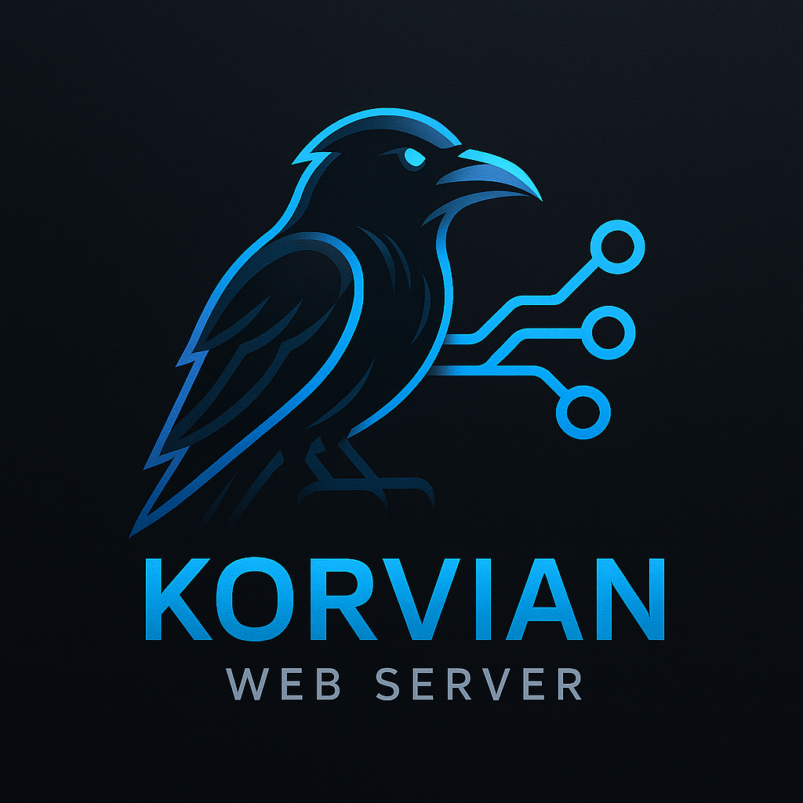

  

<h1 align="center">Korvian Web Server (Experimental)</h1>

  An opinionated Kotlin Web Server powered by a flexible message-driven core for Backend For Frontend (BFF) services. 
  Supports <b>Request/Reply</b>, <b>Request/Stream</b> and <b>Publish/Subscribe</b> communication modes out of the box, providing a seamless match for reactive frontend data flows.

---

### ✨ Features

- 📨 **Request/Reply** – Traditional synchronous messaging
- 🌊 **Request/Stream** – For reactive data flows and live responses
- 📣 **Publish/Subscribe** – Built-in event distribution

---

Korvian is designed for **scalability**, **clean Kotlin APIs**, and **efficient asynchronous processing**.
It leverages Kotlin's strengths — Annotations, DSLs, Compiler Plugins and strong typing — to give developers an intuitive and high-performance server framework.

> 🐦 **Why “Korvian”?**  
> Inspired by the raven — a messenger bird known for intelligence and adaptability — Korvian delivers fast, reliable message handling in modern server architectures.

---

### 🚀 Getting Started

> [Installation · Documentation · Examples · API Reference](_link_to_docs_)

---

